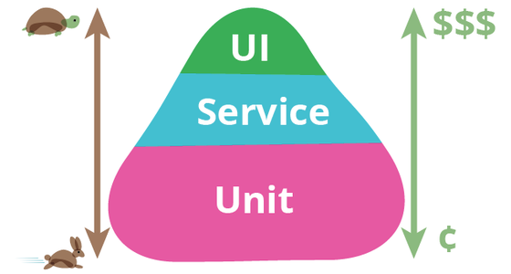

---

theme : "night"
transition: "slide"
highlightTheme: "monokai"
# logoImg: "logo.png"
slideNumber: true
title: "JavaScript Testing"

---

# JavaScript Testing

<style>
:root {
    --r-heading1-size: 72px;
    --r-heading2-size: 48px;
}
pre {
  background: #303030;
  padding: 10px 16px;
  border-radius: 0.3em;
  counter-reset: line;
}
pre code[class*="="] .line {
  display: block;
  line-height: 1.8rem;
  font-size: 1em;
}
pre code[class*="="] .line:before {
  counter-increment: line;
  content: counter(line);
  display: inline-block;
  border-right: 3px solid #6ce26c;
  padding: 0 .5em;
  margin-right: .5em;
  color: #afafaf;
  width: 24px;
  text-align: right;
}

.reveal .slides > section > section {
  text-align:left; 
}

h1,h2,h3,h4 {
  text-align: center
}

p {
  text-align: center;
}

.present img {
    max-height: 65vh;
}
</style>

<script>

    window.onload = () => setTimeout(setLineNumber, 10)
    
    const setLineNumber = () => {
        const codeBlocks = document.querySelectorAll('pre code[class*="="]')
        codeBlocks.forEach(code => {
            const addLineSpan = code.innerHTML.trim().replaceAll('\n','</span><span class="line">')
            code.innerHTML = `<span class="line">${addLineSpan}</span>`    
        })
    }
    
</script>

---

# Yubin, Hsu

## NTAD / TSID

---

# Why test

--

Check

Quality

Confidence

Automation

--

How

---

# Golden Rule

--

design a test case to be 

<div style="padding: 0 100px;">

- simple
- short
- abstraction-free
- flat
- delightful to work with

</div>

---

# The test

--

## test name

1. What is being tested?
2. What scenario?
3. What is the expected result?

--

```typescript=
// 1. unit under test
describe('Products Service', function() {
  describe('Add new product', function() {
    // 2. scenario and 3. expectation
    it('When no price is specified, then the product status is pending approval', ()=> {
      const newProduct = new ProductService().add(...);
      expect(newProduct.status).to.equal('pendingApproval');
    });
  });
});
```

--

## AAA pattern

--

Arrange

Act

Assert

--

```typescript=
describe("Customer classifier", () => {
  test("When customer spent more than 500$, should be classified as premium", () => {
    //Arrange
    const customerToClassify = { spent: 505, joined: new Date(), id: 1 };
    const DBStub = sinon.stub(dataAccess, "getCustomer").reply({ id: 1, classification: "regular" });

    //Act
    const receivedClassification = customerClassifier.classifyCustomer(customerToClassify);

    //Assert
    expect(receivedClassification).toMatch("premium");
  });
});
```

--

## Use product language

--

code the expectation in a human-like language

```typescript=
expect(myValue > 5).toBe(true)
expect(myValue).toBeGreaterThan(5) // better to read
```

https://jestjs.io/docs/expect#expectextendmatchers

--

## Test public methods

--

## Don't "foo", use real input data

--

## Make each test case independent

~~global test fixture~~

--

## No catch, expect them

```typescript=
it('should return 200 status code when call /api/todos API', async() => {
    try {
        const response = await axios.get('/api/todos')
        expect(response.status).toBe(200)
    } catch(error) {
        fail(`${error}`)
    }
})
```

↓

```typescript=
it(' should return 200 status code when call /api/todos API', async() => {
    const response = await axios.get('/api/todos')
    expect(response.status).toBe(200)
})
```

---

# Types of tests

- End-to-End, simulate user behavior
- Integration, multiple units work together
- Unit, simgle function/component
- Static, code typo or error

---

# TestPyramid



https://martinfowler.com/bliki/TestPyramid.html

---

# Priority

--

1. High value features
2. Edge cases in high value features
3. Things that are easy to break
4. Basic React component testing
    - User interactions
    - Conditional redering
    - Utils / Hooks

---

# Jest

JavaScript testing framework

https://github.com/facebook/jest

https://jestjs.io/

--

## npm script

react use jest on default

https://create-react-app.dev/docs/running-tests/

```json
"scripts": {
  "test": "react-scripts test --coverage --watchAll=false",
},
```

```text
npm run test
```

--

# A Jest Test

```typescript=
const expected = true
const actual = false

describe('my test suite01', () => {
    test('it works', () => {
        expect(actual).toBe(expected)
    })
})

```

--


--

```typescript

describe('API test', () => {    
    it('should successfully get a pong string', () => {
        // Some testing condition
    })
    it('test B', () => {})
    it('test C', () => {})
    it('test D', () => {})
})
```


--

## Expect

https://jestjs.io/docs/expect

```typescript
expect(1 + 2).toBeLessThan(4)
expect(1 + 2).toBeLessThanOrEqual(3)
expect(['A', 'B', 'C']).toContain('B')
expect(1 + 2).not.toBe(4)
```

--

## Synchronous

```typescript
describe('Math test', () => {
    it('1 + 2 should be 3', () => {
        const a = 1
        const b = 2
        expect(a + b).toBe(3)
    })
})
```

--

## Asynchronous

```typescript
// pong.ts
async getPong(): Promise<string> {
    return new Promise((resolve) => {
        resolve('pong')
    })
}

// pong.spec.ts
describe('asynchronous test', () => {
    it('get pong', async () => {
        const result = await pong.getPong()
        expect(result).toBe('pong')
    })
    it('still get pong', async () => {
        await expect(pong.getPong()).resolves.toBe('pong')
    })
})
```

---

# Testing Library

--

## @testing-library/react

https://github.com/testing-library/react-testing-library

🐐 Simple and complete React DOM testing utilities that encourage good testing practices. 

--

## @testing-library/user-event

https://github.com/testing-library/user-event

🐕 Simulate user events

---

# Mirage

--

miragejs

https://github.com/miragejs/miragejs

Mirage JS is an API mocking library that lets you build, test and share a complete working JavaScript application without having to rely on any backend services.

---

# Demo project

for adding some test cases

https://github.com/yubinTW/todos

--


--

"My Todos" title should be show

Add-button is disabled on default

--

```typescript=
import { render, screen, waitFor } from '@testing-library/react'
// ...
it('should show the title', () => {
    render(<App />)
    const todoTitle = screen.getByText('My Todos')
    expect(todoTitle).toBeInTheDocument()
})
```

--

```typescript=
test('Add button is disabled on default', async () => {
    render(<App />)
    const addButton = await screen.findByText('Add Todo')
    expect(addButton).toBeDisabled()
})
```

--


When "Name" and "Description" input are not empty, add-button will be enabled

--

```typescript=
test('Add button is enabled when name and description are not empty', async () => {
    render(<App />)

    const nameInput = await screen.findByTestId('name')
    const descriptionInput = await screen.findByTestId('description')
    await userEvent.type(nameInput, 'Prepare slide')
    await userEvent.type(descriptionInput, 'slider for javascript testing')

    const addButton = await screen.findByText('Add Todo')
    expect(addButton).toBeEnabled()
})
```

--


When click add-button, "Name" and "Description" input will be clear, and new todo record will appear

--

```typescript=
test('new todo will appearance, name and description input will be clear when click Add Todo button', async () => {
    render(<App />)

    const nameInput = await screen.findByTestId('name')
    const descriptionInput = await screen.findByTestId('description')
    await userEvent.type(nameInput, 'Prepare slide')
    await userEvent.type(descriptionInput, 'slider for javascript testing workshop')
    const addButton = await screen.findByText('Add Todo')
    await userEvent.click(addButton)
    const newTodo = await screen.findByText('Prepare slide')

    expect(nameInput).toHaveTextContent('')
    expect(descriptionInput).toHaveTextContent('')
    expect(newTodo).toBeInTheDocument()
})
```

--


When click delete button of item0, item0 will disappear

--

```typescript=
it('should be disappear when user click delete button of a todo', async () => {
    render(<App />)

    const deleteButtons = await screen.findAllByText('Delete')
    await userEvent.click(deleteButtons[0])

    await waitFor(() => {
      const item0 = screen.queryByText('item0')
      expect(item0).toBeNull()
    })
})
---

## DIY

Try to add test case for other user scenario

---

## Reference

[Testing-Library/CoreAPI/Queries](https://testing-library.com/docs/queries/about)

[Testing-Library/user-event](https://testing-library.com/docs/ecosystem-user-event/#typeelement-text-options)

[React Testing Library 的一些實用的小技巧](https://ithelp.ithome.com.tw/articles/10281691)

---

end